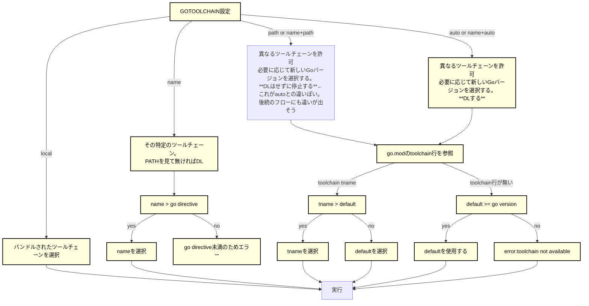

# 概要
Go1.21から導入された Go Toolchains の動きを確認するためのディレクトリ。

# 実行バージョンの選択
default とは、バンドルされたGoバージョンを指す。

```mermaid

graph TD
    classDef lightYellow fill:#FFFFE0,stroke:#000,stroke-width:2px,color:#000;
    A[GOTOOLCHAIN設定]
    A -->|local| B[バンドルされたツールチェーンを選択]
    A -->|name| C[その特定のツールチェーン。<br>PATHを見て無ければDL]
    C --> N[name > go directive]
    N -->|yes| O[nameを選択]
    N -->|no| P[go directive未満のためエラー]
    A -->|path or name+path| D[異なるツールチェーンを許可<br>必要に応じて新しいGoバージョンを選択する。<br>**DLはせずに停止する**←これがautoとの違いぽい。後続のフローにも違いが出そう]
    A -->|auto or name+auto| E[異なるツールチェーンを許可<br>必要に応じて新しいGoバージョンを選択する。<br>**DLする**]

    F[go.modのtoolchain行を参照]
    D --> F
    E --> F
    F -->|toolchain tname| H[tname > default]
    F -->|toolchain行が無い| I[default >= go version]
    H -->|yes| J[tnameを選択]
    H -->|no| K[defaultを選択]
    I -->|yes| L[defaultを使用する]
    I -->|no| M[error:toolchain not available]
        
    Z[実行]
    B --> Z
    J --> Z
    K --> Z
    L --> Z
    M --> Z
    O --> Z

    class A,B,C,E,F,H,I,J,K,L,M,N,O,P lightYellow;
```

# 参考
公式ドキュメント：[Go Toolchains](https://go.dev/doc/toolchain)
