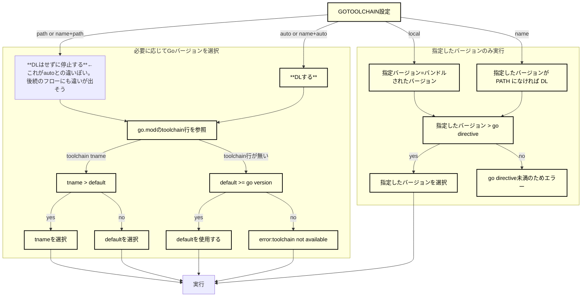

# 概要
Go1.21から導入された Go Toolchains の動きを確認するためのディレクトリ。

# 実行バージョンの選択
次のフローチャートは、go build を実行した時、ビルドされるバージョン選択の仕組みを図示したもの。
（goコマンドの中でも go version を実行する場合は、go.modのgo directiveの影響を受けないため go build に限定する）
default とは、バンドルされたGoバージョンを指す。

# 参考
公式ドキュメント：[Go Toolchains](https://go.dev/doc/toolchain)
