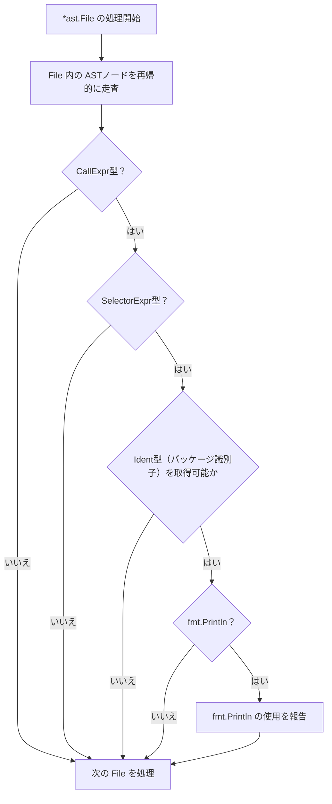

# 静的解析の概要

fmt.Println の使用を検出する静的解析ルール。
*analysis.Pass.Files の各ファイルに対して次の処理フローを実行している。

```mermaid
graph TD
B[*ast.File の処理開始]
B --> C[File 内の ASTノードを再帰的に走査]
C --> D{CallExpr型？}
D -- いいえ --> J[次の File を処理]
D -- はい --> E{SelectorExpr型？}
E -- いいえ --> J
E -- はい --> F{Ident型（パッケージ識別子）を取得可能か}
F -- いいえ --> J
F -- はい --> G{fmt.Println？}
G -- いいえ --> J
G -- はい --> H[fmt.Println の使用を報告]
H --> J
```

# 静的解析のテストコード

"golang.org/x/tools/go/analysis/analysistest"
